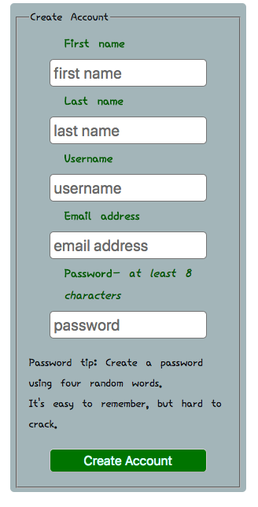

# Daily Diary

## Introduction

Daily Diary is an application that encourages and allows users to track gratitudes and goals.  Approaching the world from this wholistic and positive view point enables the user to stay focused and grateful.

## Screenshots

### Dashboard

### Modal

### Signup

## User Experience
This application allows users to create a private account. Once logged in to their account, they are presented with the options of Goals and Gratitudes. They can add, update, delete or view gratitudes and goals The user can do this as many times as they would like. Once submitted, the user can then see their posts in the by selecting View goals and gratitudes.

## Technical

This application was built using mobile-first development. It is fully-responsive, adapting to mobile, tablet and desktop views.

### Front-End
- HTML5
- CSS3
- JQuery

### Back-End
- Node
- Express
- MongoDB
- Bcrypt
- JSON Web Tokens
- Passport

### Testing and Deployment
- Mocha
- Chai
- Faker
- Travis CI
- Heroku
- mLab

## Future Development

- Use daily.js to create daily logging
- Add word cloud capabilities
- Show higlighted goals and gratitudes in the dashboard
- Pagination/organization of previous entries
- Search and retrieve gratitudes and goals by dates, numbers and other parameters